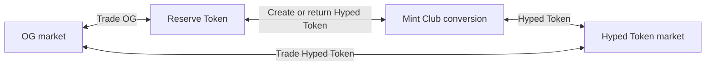
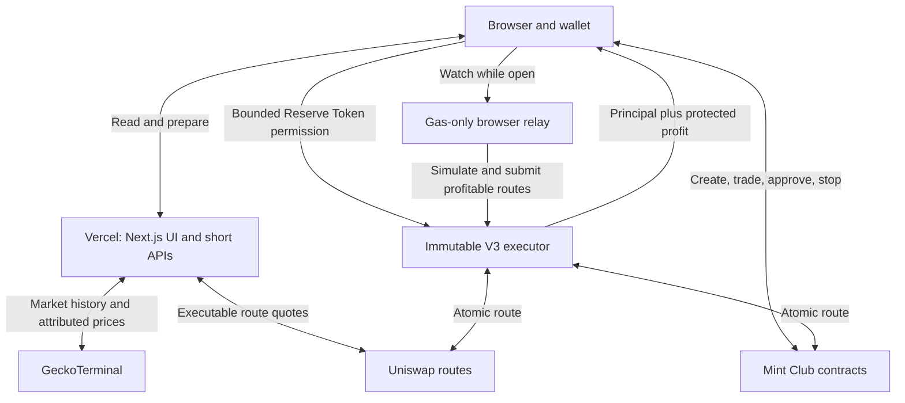

# GETHYPED

GETHYPED creates a **Hyped Token** backed by an existing ERC-20 token and connects both assets through executable markets.

The product has three parts:

1. Select an existing token, called the **OG token** or **Reserve Token**.
2. Create a Hyped Token whose Mint Club conversion holds that Reserve Token as backing.
3. Connect the OG market, Mint Club conversion and Hyped Token market so price differences can be checked and, when profitable after costs, executed as arbitrage.

The interface uses real contract reads, real market data and wallet-signed transactions. It does not seed sample markets or portfolio positions.

## Product flow



For an `MT / hMT` market, GETHYPED checks both closed routes:

- `MT → create hMT through Mint Club → sell hMT through its market → MT`
- `MT → buy hMT through its market → return hMT through Mint Club → MT`

WETH may be used inside a Uniswap route, but it is not the user's accounting asset. The budget, limits, protected profit and final settlement all use the market's Reserve Token.

Historical charts explain how the two assets moved. They do **not** decide whether an opportunity exists. Only current executable quotes, pinned to the same block and checked after route costs, can produce an arbitrage opportunity.

## What is implemented

### Create a pool

- Finds an ERC-20 on Base or Robinhood Chain from its address.
- Shows live provider-ranked trending tokens as optional shortcuts.
- Reads token identity and supported market data instead of creating placeholders.
- Calculates a Mint Club curve from the selected OG token's attributed USD price.
- Uses a system-owned maximum backing target of approximately `$1M`.
- Re-checks pricing before the wallet signs.
- Sends the user-selected Hyped Token logo directly through the Mint Club upload flow; no application image database is required.

### Markets

- Reads supported networks in parallel and presents one asset list.
- Shows the Hyped Token price, market cap, current backing and primary action.
- Uses real token logos with compact network marks.
- Opens each market in the arbitrage view, with OG and Hyped Token trading available from the same detail page.

### Arbitrage

- Checks both Reserve Token round trips.
- Lets the user enter one Reserve Token amount and execute from one action.
- Uses that amount for each run.
- Sets the repeat limit automatically, capped by wallet balance.
- Tries now, then keeps watching.
- Keeps funds in the wallet between runs.
- Returns principal and profit in the Reserve Token.
- Reverts if the protected return is not met.
- Lets the user stop and remove permission.

The current immutable fee policy is:

- GETHYPED protocol fee: `0%`
- Successful executor reward: `20%` of realized Reserve Token profit
- User share: `80%` of realized Reserve Token profit

### Portfolio and security

- Shows active arbitrage routes, realized Reserve Token profit and execution history.
- Preserves earlier one-time V2 permissions so users can review and revoke them.
- Reads verified deployment bytecode and contract boundaries from the selected network.
- Keeps user approvals explicit and bounded.

## Architecture



The web application and relay are intentionally bounded:

- **Vercel** serves the interface and request-response APIs.
- **Browser relay** runs only while a user tab is watching, uses a separate low-balance key and has request and daily gas limits.
- **Persistent keeper** is optional and must run on a separate worker, VM or container with a different key.
- **Executor contract** enforces the entered Reserve Token amount, protected profit and stop state.

The relay and optional keeper do not custody funds and have no privileged contract role. They only submit executions that the immutable contract independently validates.

## Data sources and source of truth

| Information                                            | Source of truth                               |
| ------------------------------------------------------ | --------------------------------------------- |
| Token metadata, balances, supply and backing           | Selected network contracts                    |
| Hyped Token creation and return quotes                 | Mint Club Bond contract and SDK               |
| OG and Hyped Token routes                              | Uniswap Trading API / Base Onchain Router     |
| Historical market chart and attributed USD price       | GeckoTerminal                                 |
| Active strategy, limits and realized execution history | `HypedArbitrageExecutorV3` events and storage |
| Wallet permission                                      | Reserve Token allowance onchain               |

Public historical data may be cached. Wallet balances, permissions, strategy state and transaction preparation are never shared-cacheable.

## Base deployment

The current V3 Reserve Token executor is verified on Base:

- Contract: [`0xbB7AF71818fD1a269f21D0b5E4d8F7CF5401Ac3C`](https://basescan.org/address/0xbB7AF71818fD1a269f21D0b5E4d8F7CF5401Ac3C)
- Deployment block: `50422622`
- Deployment transaction: [`0x9314bccfdc606c7e98374526d802c2fad4494abfae3eff74ac53bb8c47881682`](https://basescan.org/tx/0x9314bccfdc606c7e98374526d802c2fad4494abfae3eff74ac53bb8c47881682)
- Source verification: Sourcify exact match

See [contracts/DEPLOYMENT.md](contracts/DEPLOYMENT.md) for the immutable inputs and previous recovery deployments.

## Local setup

Requirements:

- Node.js 20 or newer
- npm
- Foundry, only when developing or testing Solidity contracts

Install and configure:

```bash
npm install
cp .env.example .env.local
```

Fill only the values needed for the features you are running. Never commit `.env.local`.

Start the website:

```bash
npm run dev
```

Open [http://localhost:3000](http://localhost:3000).

## Environment variables

### Website and Vercel

```text
UNISWAP_API_KEY=
UNISWAP_FEE_RECIPIENT=
NEXT_PUBLIC_ARBITRAGE_EXECUTOR_V3=0xbB7AF71818fD1a269f21D0b5E4d8F7CF5401Ac3C
ARBITRAGE_EXECUTOR_V3_DEPLOYMENT_BLOCK=50422622
BASE_RPC_URL=
ROBINHOOD_RPC_URL=
ARBITRAGE_RELAYER_PRIVATE_KEY=
ARBITRAGE_RELAY_DAILY_GAS_WEI=1000000000000000
```

`UNISWAP_API_KEY` and RPC credentials are server-only. `UNISWAP_FEE_RECIPIENT` must be a reviewed project-controlled address.

Keep the V2 and legacy executor variables only when earlier permissions must remain visible for recovery:

```text
NEXT_PUBLIC_ARBITRAGE_EXECUTOR_V2=
ARBITRAGE_EXECUTOR_V2_DEPLOYMENT_BLOCK=
NEXT_PUBLIC_ARBITRAGE_EXECUTOR=
ARBITRAGE_EXECUTOR_DEPLOYMENT_BLOCK=
```

### Browser relay

Users click once, then the open browser tab watches the active position. When the route is executable, Vercel sends the transaction through a gas-only relay wallet.

```text
ARBITRAGE_RELAYER_PRIVATE_KEY=
BASE_RPC_URL=
NEXT_PUBLIC_ARBITRAGE_EXECUTOR_V3=0xbB7AF71818fD1a269f21D0b5E4d8F7CF5401Ac3C
```

Keep the relay wallet funded only for Base gas. The relay cannot move funds beyond the user-approved strategy limits.
The default per-instance relay ceiling is `0.001 ETH` per UTC day. Set a lower production value after measuring Base execution costs.

### Persistent keeper only

Do not put the keeper private key in Vercel or expose it to the browser.

```text
ARBITRAGE_KEEPER_PRIVATE_KEY=
BASE_RPC_URL=
NEXT_PUBLIC_ARBITRAGE_EXECUTOR_V3=0xbB7AF71818fD1a269f21D0b5E4d8F7CF5401Ac3C
ARBITRAGE_POLL_MS=12000
ARBITRAGE_SLIPPAGE_BPS=50
ARBITRAGE_GAS_MARGIN_BPS=12000
```

Use a dedicated gas-only wallet with a small ETH balance. Start the persistent process with:

```bash
npm run keeper
```

Run a single operational health check without leaving a process running:

```bash
ARBITRAGE_KEEPER_ONCE=1 npm run keeper
```

## Verification

Run the application checks:

```bash
npm run lint
npm test
npx tsc --noEmit
npm run build
```

Run the Solidity checks:

```bash
cd contracts
forge fmt --check
forge test
```

The current release passes 25 application tests and 36 contract tests, plus Base fork coverage for the existing execution paths.

## Repository map

```text
app/                     Next.js pages and server API routes
components/              Wallet, pool creation, market and portfolio UI
lib/                     Chain configuration, pricing and onchain services
scripts/                 Continuous and recovery keeper processes
contracts/src/           Immutable Solidity executors
contracts/test/          Unit and Base fork tests
DESIGN.md                Product language, layout and data-truth rules
contracts/DEPLOYMENT.md  Verified contract deployment record
```

## Security model

The V3 executor has no owner, guardian, upgrade function, arbitrary external call or withdrawal function. It stores no user funds between executions. The user grants a bounded Reserve Token allowance and can stop the strategy at any time.

Important boundaries:

- A visible historical price difference is not guaranteed profit.
- Every execution depends on current liquidity, price impact, fees and Base gas.
- The relay or optional keeper submits transactions only when its simulation is profitable and gas-covered.
- The contract performs the final atomic minimum-return enforcement.
- Token behavior can still introduce external risk; unsupported or non-standard assets must not bypass creation checks.
- This repository is software, not a promise of returns or financial advice.

See [SECURITY.md](SECURITY.md) for responsible disclosure and production-key handling.

## Current network scope

- Base: pool creation, markets, trade flows and the V3 arbitrage executor.
- Robinhood Chain: token discovery and pool creation are beta; arbitrage is not presented as live until a separately verified deployment exists.
